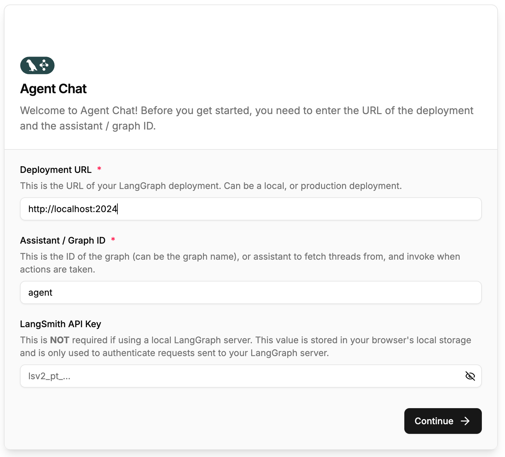

# Deep Code Agent

A comprehensive AI-powered coding assistant built on DeepAgents, featuring specialized subagents for code review, testing, documentation, debugging, and refactoring.

## Features

### Core Capabilities

- **Code Review**: Analyzes code for quality, best practices, and potential issues
- **Test Generation**: Creates comprehensive unit tests with high coverage
- **Documentation**: Generates professional documentation including docstrings and READMEs
- **Debugging**: Identifies and resolves code errors with step-by-step guidance
- **Refactoring**: Suggests improvements for code structure, performance, and maintainability

### Technical Highlights

- Built on DeepAgents framework for agent orchestration
- Integrates with LangChain and LangGraph for advanced LLM capabilities
- Supports OpenAI and custom LLM models
- File system integration for working with codebases
- Terminal command execution with safety controls
- Extensible subagent architecture

## Installation

### Prerequisites

- [uv](https://docs.astral.sh/uv/getting-started/installation/): An extremely fast Python package and project manager, written in Rust.

### Install from Source

1. Clone the repository:

   ```bash
   git clone https://github.com/hzhaoy/deep-code-agent.git
   cd deep-code-agent
   ```

2. Install dependencies:

   ```bash
   uv sync
   ```

## Configuration

### Environment Variables

Create a `.env` file from the example template and configure your settings:

```bash
cp .env.example .env
```

Edit `.env` with your configuration:

```env
# OpenAI API Configuration
OPENAI_API_KEY=your-openai-api-key-here
OPENAI_API_BASE=https://api.openai.com/v1

# LLM Model Configuration
MODEL_NAME=your-model-name-here
```

## Usage

### ⚠️ Important Warning

**WARNING:** This agent will directly modify files in the specified codebase directory. Please:

- Ensure you understand the changes it will make
- Back up your codebase before running the agent
- Consider running on a test/development branch first
- Review all changes thoroughly before merging to production

### Basic Usage

```python
from deep_code_agent import create_code_agent

# Initialize the agent with your codebase directory
agent = create_code_agent("your-codebase-directory")

# Run the agent
state = {"messages": [{"role": "user", "content": "What are the main features of this project?"}]}
config={"configurable": {"thread_id": "1"}}
for step in agent.stream(state, config=config, stream_mode="values"):
    step["messages"][-1].pretty_print()
```

### Command Line Interface

```bash
# Run the agent
python -m deep_code_agent
```

### Working with Subagents

The Deep Code Agent includes specialized subagents that can be used independently or as part of the main workflow:

- **code_reviewer**: For code quality analysis
- **test_writer**: For generating unit tests
- **documenter**: For creating documentation
- **debugger**: For error resolution
- **refactorer**: For code improvements

## Local Development & Testing with LangGraph CLI

- Configure `.env` with required keys and model settings
- Update `server/agent.py` to set `codebase_dir` to your target path
- Start the dev server: `cd server && uv run langgraph dev`. If the server starts successfully, you will see output similar to the following:

   ```text
   INFO:langgraph_api.cli:

         Welcome to

   ╦  ┌─┐┌┐┌┌─┐╔═╗┬─┐┌─┐┌─┐┬ ┬
   ║  ├─┤││││ ┬║ ╦├┬┘├─┤├─┘├─┤
   ╩═╝┴ ┴┘└┘└─┘╚═╝┴└─┴ ┴┴  ┴ ┴

   - 🚀 API: http://127.0.0.1:2024
   - 🎨 Studio UI: https://smith.langchain.com/studio/?baseUrl=http://127.0.0.1:2024
   - 📚 API Docs: http://127.0.0.1:2024/docs

   This in-memory server is designed for development and testing.
   For production use, please use LangSmith Deployment.
   ```

- Visit the [Agent Chat UI](https://agentchat.vercel.app/), input the Deployment URL with the API url show above (here is `http://127.0.0.1:2024`) and Assistant / Graph ID (defined in [langgraph.json](server/langgraph.json), here is `agent`). Now you can start chatting with the agent for clicking continue.
   

## Project Structure

```plaintext
deep-code-agent/
├── src/
│   └── deep_code_agent/
│       ├── __init__.py            # Package initialization
│       ├── __main__.py            # CLI entry point
│       ├── code_agent.py          # Main agent implementation
│       ├── tools/
│       │   ├── __init__.py
│       │   └── terminal.py        # Terminal command tool
│       └── models/
│           └── llms/
│               └── langchain_chat.py  # LLM integration
├── .env.example                   # Environment variables template
├── .gitignore                     # Git ignore rules
├── .python-version                # Python version pin
├── LICENSE                        # License
├── README.md                      # Project documentation
├── pyproject.toml                 # Project configuration
└── uv.lock                        # Dependency lockfile
```

## Architecture

### Main Components

1. **Code Agent Core**: The main orchestrator that manages the workflow
2. **Subagents**: Specialized agents for specific tasks
3. **LLM Integration**: Connects to language models via LangChain
4. **File System Backend**: Interfaces with the codebase
5. **Terminal Tool**: Executes commands safely

### Subagent Architecture

Each subagent has its own system prompt and tools, allowing for specialized behavior:

- **Code Reviewer**: Focuses on code quality and best practices
- **Test Writer**: Generates comprehensive test suites
- **Documenter**: Creates professional documentation
- **Debugger**: Identifies and fixes errors
- **Refactorer**: Improves code structure and performance

### Agent Flow Diagram


## License

MIT License - see the [LICENSE](LICENSE) file for details.

## Acknowledgments

- Built on [DeepAgents](https://github.com/langchain-ai/deepagents) framework
- Integrates with [LangChain](https://github.com/langchain-ai/langchain) and [LangGraph](https://github.com/langchain-ai/langgraph)
- Inspired by modern AI coding assistants

## Support

For issues, questions, or feedback, please:

1. Check the [Issues](https://github.com/hzhaoy/deep-code-agent/issues) page
2. Create a new issue if needed
3. Join our community discussions

---

**Deep Code Agent** - Empowering developers with AI-assisted coding excellence
